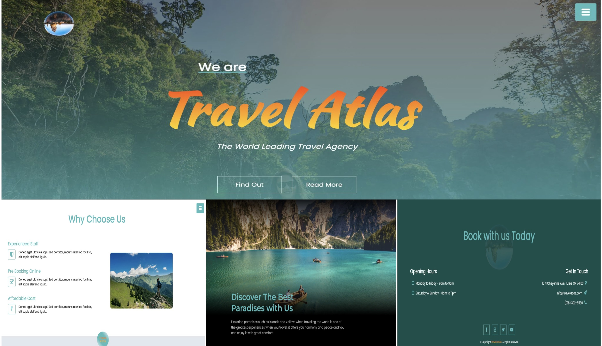
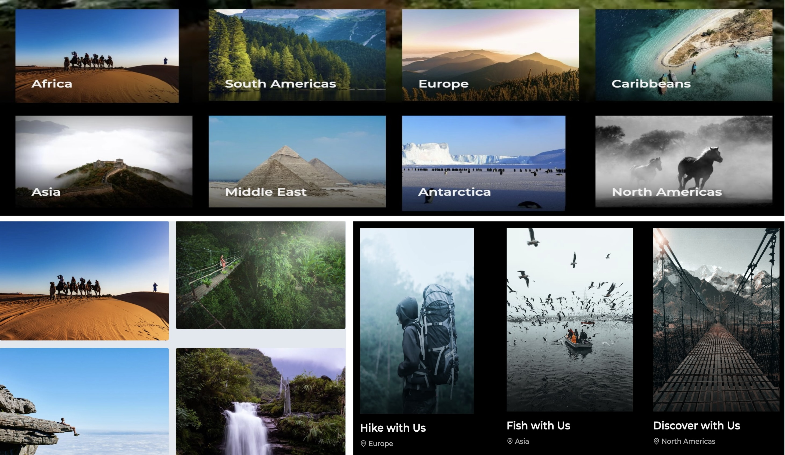
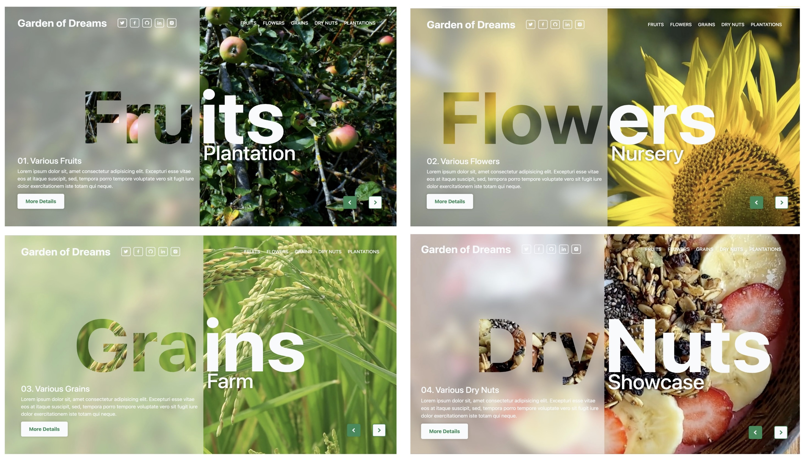
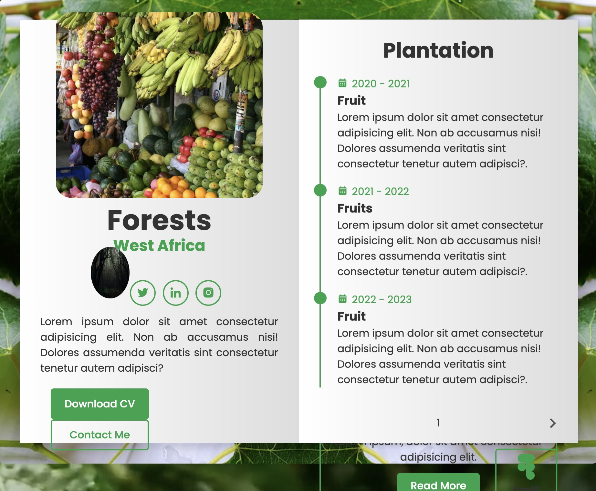

# Discover the Beauty of the Nature with Us
## Come to our Travel Atlas! We will take you to the all nature sites on the whole wild earth. You can visit different continent, experience the exciting activities, breath dreamlike aromas, and taste the local nature delicacies. So, come and join us!

## Do you like to watch an endless desert review, or adventure at a mist jungle? Do you want to climb a steep cliff? or relax whole your mind in the salty water? Come and join us!

## You can travel all over the world and taste various natures.

## For each of those catalogs, you can find it's individual booklet:

## Your journey starts here:

## Authors:
- Frandy Slueue
- Mei Sibley
